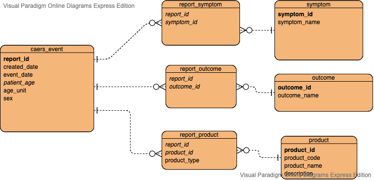

# Overview

# Table Design

# Import

# Database Information

# Query Results

## Exploring Data

1.
 count 
-------
 80014
(1 row)
it shows that there is no null value in report_id, product, product_type and craeted_date columns

2.
 patient_age | age_unit 
-------------+----------
(0 rows)
It shows if age_unit is null then patient_age must be null too
    
3.
 report_id | created_date |   product   | cout 
-----------+--------------+-------------+------
 173066    | 2014-01-09   | EXEMPTION 4 |    5
 173307    | 2014-01-22   | EXEMPTION 4 |    2
 173435    | 2014-01-27   | EXEMPTION 4 |    2
 173455    | 2014-01-28   | EXEMPTION 4 |    2
 173728    | 2014-02-05   | EXEMPTION 4 |    2
(5 rows)
it shows that many rows contain duplicate values with the composite columns (report_id, created_date, product)

4. 
 product_code |   product   |                  description                  
--------------+-------------+-----------------------------------------------
 54           | EXEMPTION 4 |  Vit/Min/Prot/Unconv Diet(Human/Animal)
 54           | EXEMPTION 4 |  Vit/Min/Prot/Unconv Diet(Human/Animal)
 54           | EXEMPTION 4 |  Vit/Min/Prot/Unconv Diet(Human/Animal)
 54           | EXEMPTION 4 |  Vit/Min/Prot/Unconv Diet(Human/Animal)
 41           | EXEMPTION 4 |  Dietary Conventional Foods/Meal Replacements
it shows that product_code might be uniquely determine product, and description

5. 
    report_id    | count 
-----------------+-------
 203819          |     1
 2018-CFS-006260 |     4
 209126          |     2
 183778          |     1
 194867          |     1
(5 rows)

    report_id    | created_date |           product            
-----------------+--------------+------------------------------
 2018-CFS-006260 | 2018-04-25   | CETAPHIL MOISTURIZING LOTION
 2018-CFS-006260 | 2018-04-25   | multi vitamin
 2018-CFS-006260 | 2018-04-25   | vitamin d
 2018-CFS-006260 | 2018-04-25   | fish oil
(4 rows)

It turns out that there are duplicate rows, need to separate products from report

## Database Design

